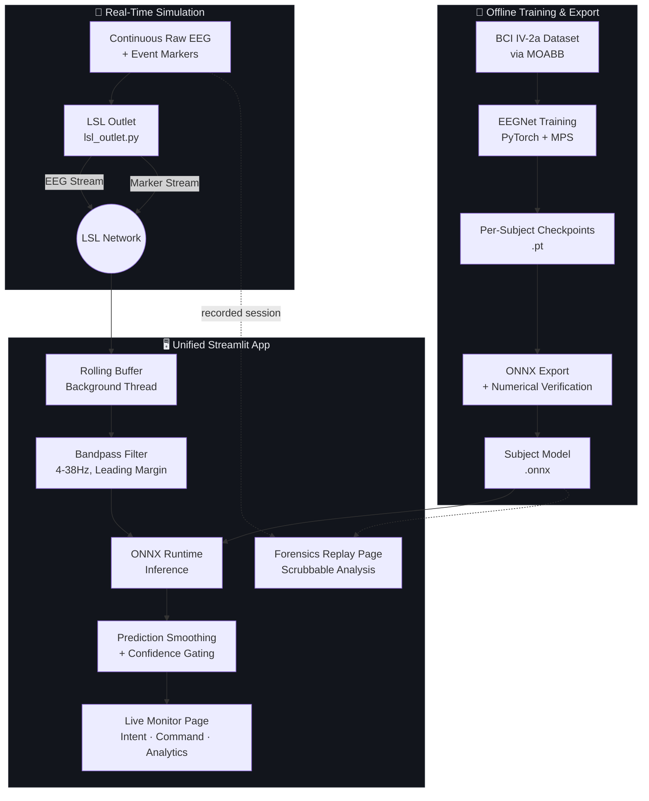

# Real-Time Motor Imagery BCI Pipeline

An end-to-end brain-computer interface system: from offline EEG model training through real-time signal streaming, live inference, and an assistive-device-style monitoring dashboard. Built as a full engineering exercise in taking a research dataset (BCI Competition IV-2a) from offline classification to a working real-time decision system — and being explicit about what changes, and what breaks, when you make that jump.

**Further reading:** [`docs/PROJECT_NARRATIVE.md`](docs/PROJECT_NARRATIVE.md) (the full build story) · [`docs/decisions.md`](docs/decisions.md) (engineering decision log) · [`docs/EXTERNAL_REVIEW.md`](docs/EXTERNAL_REVIEW.md) (independent technical review + response)

## What this is

- A trained EEGNet model (PyTorch → ONNX) classifying 4-class motor imagery (left hand, right hand, feet, tongue) from EEG
- A real-time streaming simulation (LSL) replaying recorded EEG as if a live headset were connected
- A live dashboard: prediction smoothing, confidence-gated rejection, a device-command mapping, live confusion matrix, session logging, and per-channel signal quality
- A forensics/replay tool for offline debugging and analysis of recorded sessions
- An honest account of a real validation-methodology bug found and fixed late in the project, and of the real-time vs. offline accuracy gap that remains — and why

## What this is not

- Not tested on real EEG hardware — this uses the BCI Competition IV-2a dataset, replayed over LSL to simulate a live headset
- Not a solved BCI product — subject-specific calibration, model adaptation without labels, and long-term reliability remain open problems (see **Limitations**)
- Not benchmarked against a classical baseline (CSP/Riemannian) — see **Engineering Roadmap**

## Architecture



## Screenshots

**Live Monitor** — real-time intent detection, device command mapping, and session analytics


**Accessibility Mode** — larger text, higher contrast, reduced motion


**Forensics Replay** — offline scrubbable analysis of recorded sessions, with ground-truth-aligned scoring


## Results

### Offline classification (per subject, corrected methodology, mean ± SD across 2 independent runs)

A validation-methodology flaw was discovered late in the project — checkpoint selection during training was using the same held-out session (`1test`) that final accuracy was reported against, a form of test-set leakage. This was fixed with a strict three-way split: an inner train/validation split (carved from session `0train`) determines the training stopping point, then a fresh model is refit on the **full** `0train` session using that stopping point, and evaluated **exactly once** against the true held-out `1test` session. See `docs/decisions.md` (D-013) for the full account.

| Subject | Run 1 | Run 2 | Mean ± SD |
|---|---|---|---|
| 1 | 77.4% | 73.3% | 75.4% ± 2.1% |
| 2 | 30.9% | 39.6% | 35.3% ± 4.4% |
| 3 | 73.3% | 75.3% | 74.3% ± 1.0% |
| 4 | 51.0% | 52.8% | 51.9% ± 0.9% |
| 5 | 35.8% | 36.5% | 36.2% ± 0.4% |
| 6 | 40.6% | 44.4% | 42.5% ± 1.9% |
| 7 | 70.1% | 67.4% | 68.8% ± 1.4% |
| 8 | 73.3% | 74.7% | 74.0% ± 0.7% |
| 9 | 78.8% | 75.7% | **77.3% ± 1.6%** (best — live-demo subject) |
| **Overall mean** | | | **59.5% ± 16.9%** |

Chance level for 4-class classification is 25%. Correcting the methodology dropped the overall mean from an earlier, leakage-inflated 62.9% to 59.5% — but not uniformly. Subjects 1, 3, 8, and 9 (strong signal) dropped modestly (2–10 points); subjects 5 and 6 (already near chance) barely moved at all. Subjects 2 and 7, previously reported as solid mid-tier performers (57.6%, 61.8%), initially collapsed to near-chance once leakage was removed — and diverged from there under further investigation: subject 7 recovered to 68.8% once given the full 288-trial training set (a genuine data-starvation effect, not leakage), while subject 2 stayed near chance regardless of data volume (35.3% — evidence its earlier "good" score was leakage-driven illusion, not real signal). This differential pattern is, itself, one of the more informative findings of the corrected evaluation — see `docs/PROJECT_NARRATIVE.md` for the full discussion.

### Inference latency (ONNX Runtime, CPU, single-trial, n=200)

| Backend | Mean | P95 |
|---|---|---|
| PyTorch (CPU) | 1.62 ms | 2.29 ms |
| PyTorch (MPS) | 0.93 ms | 1.05 ms |
| **ONNX Runtime (CPU)** | **0.29 ms** | **0.32 ms** |

ONNX Runtime CPU was selected for the real-time pipeline. **Scope note:** this is model *compute* latency only — total system decision latency also includes the mandatory window-fill time (the model requires 4 seconds of signal before a first prediction is possible), which dominates the real-time latency budget by three orders of magnitude. Compute time was never the bottleneck; it is reported here because it was measured and benchmarked, not because it is the number that matters most for a deployed device.

### Real-time vs. offline accuracy (Subject 1, corrected model)

| Metric | Offline | Real-time |
|---|---|---|
| Accuracy | 75.4% (mean of 2 runs) | 63.8% full-window (868/1360 scored) / 60.5% precision-window (202/334 scored) |

**Why the gap exists, and why it is structural, not a defect being hidden**: offline evaluation filters the entire continuous recording once, so every training epoch has real EEG data on both sides of it. Real-time inference has no access to future data — the zero-phase filter (`filtfilt`) used to match training preprocessing has to pad the newest edge of each window, distorting exactly the portion closest to "now." A concrete, industry-standard fix (a causal, stateful filter) is known and scoped but not yet implemented — see **Engineering Roadmap**. For comparison, published real-time 4-class motor imagery systems on comparable consumer-grade hardware report online accuracies around 35–41%; this system's 60–64% is meaningfully above that range even with the filtering limitation unresolved.

## Setup

```bash
git clone https://github.com/BurhanxGodhra/mi-bci-pipeline.git
cd mi-bci-pipeline
python3.11 -m venv venv
source venv/bin/activate
pip install -r requirements.txt
```

**Before first run**, train at least the subjects you intend to use (this populates `models/`, which is gitignored and not shipped in the repo):
```bash
cd src/training
python train_all_subjects.py    # trains all 9 subjects; takes several minutes
```

## Running the system

```bash
streamlit run src/app/Live_Monitor.py
```

This single command launches the full app (Live Monitor + Forensics Replay pages). Select a subject in the sidebar and click **Connect / Switch Subject** — the app manages the underlying EEG stream subprocess automatically, no separate terminal needed.

## Project Structure

```
mi-bci-pipeline/
├── src/
│   ├── training/     # EEGNet architecture, offline training, multi-subject driver
│   ├── export/       # PyTorch -> ONNX export, verification, latency benchmark
│   ├── streaming/     # LSL outlet (simulated headset), session recording
│   ├── inference/     # Rolling buffer, real-time filtering, sanity-check scripts
│   ├── common/         # Shared constants/config (bci_utils.py) used project-wide
│   ├── app/             # Unified Streamlit app (Live Monitor + Forensics Replay)
│   ├── forensics/         # Offline replay analysis engine
│   └── utils/               # Misc helpers
├── docs/               # Narrative, decision log, external review, diagrams, screenshots
├── data/processed/    # Recorded sessions (gitignored, generated at runtime)
├── models/            # Trained checkpoints + exported ONNX models (gitignored)
├── logs/               # Training results, session logs
├── notebooks/           # Exploratory analysis
└── requirements.txt
```

**Note:** `data/`, `models/`, and `venv/` are intentionally excluded from version control (see `.gitignore`) — they're regenerated by running the training and streaming scripts described above, not shipped as static files.

## Limitations

Structural constraints, inherent to the current design, not resolved by more engineering time alone:

- **No real headset tested** — this system has only been validated against replayed dataset recordings.
- **No cross-subject transfer** — each model is trained on one person's own calibration data; deploying to a new user requires their own labeled calibration session.
- **No online adaptation** — the model does not update itself during use. Real deployment would need periodic recalibration, an explicit user-feedback correction loop, or unsupervised drift compensation — partially-open problems in BCI research, not solved here.
- **BCI illiteracy is unexplained, not just unsolved** — subjects 2, 5, and 6 perform near chance under the corrected evaluation; the underlying cause (signal-to-noise, individual motor imagery strategy, electrode-level factors) was not further investigated.

## Engineering Roadmap

Concrete, scoped next steps — identified in part through an independent external technical review (`docs/EXTERNAL_REVIEW.md`), prioritized by expected impact:

1. **Causal, stateful real-time filtering.** Replace `filtfilt` (zero-phase, requires padding/future-adjacent data) with `scipy.signal.sosfilt` using persistent filter state (`zi`) carried across prediction cycles. Expected to eliminate the leading-edge distortion driving part of the real-time/offline accuracy gap, at the cost of introducing phase delay not present in the zero-phase-filtered training data — needs empirical validation, not just implementation, before being adopted.
2. **Classical baseline (CSP + LDA or Riemannian geometry).** No non-deep-learning baseline currently exists to contextualize whether EEGNet's accuracy reflects genuine advantage over classical methods on this dataset, or is comparable to what a much simpler, faster-to-train pipeline would achieve.
3. **Leave-one-subject-out (LOSO) evaluation.** Current models are subject-specific by design; a LOSO experiment would quantify exactly how much accuracy is lost (or gained) by pooling data across subjects, informing whether a cross-subject baseline model is worth building.
4. **Configuration management layer.** Filter parameters, buffer margins, and the validated trial-scoring interval currently live as constants in `src/common/bci_utils.py`. A proper config file (YAML/JSON) with environment-specific overrides would be the production-grade next step.
5. **Test suite.** Debugging scripts (`sanity_check_*.py`) currently serve as manual, one-off verification; converting the core numerical checks (ONNX/PyTorch equivalence, filter coefficient correctness, scoring-window logic) into an automated `tests/` suite would catch regressions the way our own manual process occasionally missed them (see `docs/decisions.md`, several entries).

## Citations

This project is built on:

- **Dataset**: Brunner, C., Leeb, R., Müller-Putz, G., Schlögl, A., Pfurtscheller, G.
  (2008). *BCI Competition 2008 – Graz data set A*. Institute for Knowledge
  Discovery, Graz University of Technology. Accessed via
  [MOABB](https://github.com/NeuroTechX/moabb) (Jayaram & Barachant, 2018).
- **Model architecture**: Lawhern, V. J., Solon, A. J., Waytowich, N. R., Gordon,
  S. M., Hung, C. P., & Lance, B. J. (2018). *EEGNet: A Compact Convolutional
  Network for EEG-based Brain-Computer Interfaces*. Journal of Neural Engineering.

## License

MIT License — see [LICENSE](LICENSE) for details.
