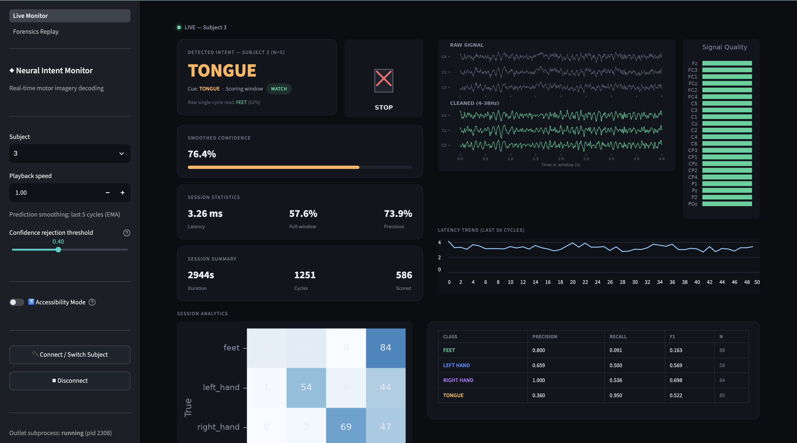
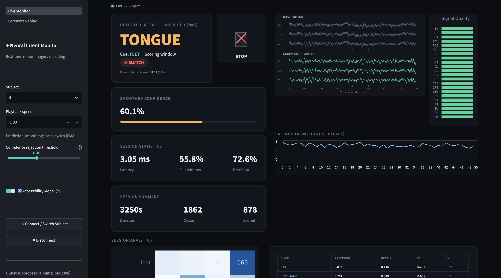
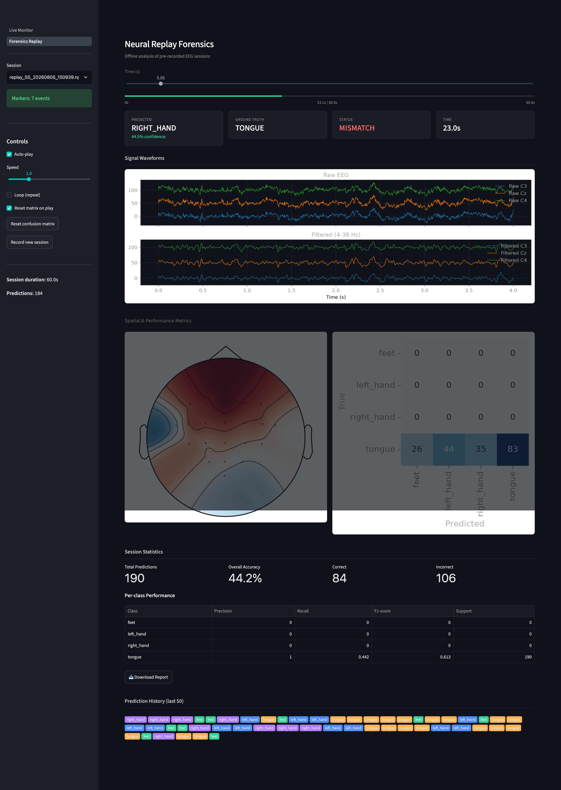

# Real-Time Motor Imagery BCI Pipeline

An end-to-end brain-computer interface system: from offline EEG model training through real-time signal streaming, live inference, and an assistive-device-style monitoring dashboard. Built as a full engineering exercise in taking a research dataset (BCI Competition IV-2a) from offline classification to a working real-time decision system — and being explicit about what changes, and what breaks, when you make that jump.

## What this is

- A trained EEGNet model (PyTorch → ONNX) classifying 4-class motor imagery (left hand, right hand, feet, tongue) from EEG
- A real-time streaming simulation (LSL) replaying recorded EEG as if a live headset were connected
- A live dashboard: prediction smoothing, confidence-gated rejection, a device-command mapping, live confusion matrix, session logging, and per-channel signal quality
- A forensics/replay tool for offline debugging and analysis of recorded sessions
- An honest account of the real-time vs. offline accuracy gap, and why it exists

## What this is not

- Not tested on real EEG hardware — this uses the BCI Competition IV-2a dataset, replayed over LSL to simulate a live headset
- Not a solved BCI product — subject-specific calibration, model adaptation without labels, and long-term reliability remain open problems (see **Limitations**)

## Architecture


## Screenshots

**Live Monitor** — real-time intent detection, device command mapping, and session analytics



**Accessibility Mode** — larger text, higher contrast, reduced motion



**Forensics Replay** — offline scrubbable analysis of recorded sessions, with ground-truth-aligned scoring




## Results

### Offline classification (per subject, BCI IV-2a session-based split)

| Subject | Val Accuracy |
|---|---|
| 1 | 74.0% |
| 2 | 57.6% |
| 3 | **81.9%** (best) |
| 4 | 58.3% |
| 5 | 38.9% (near chance) |
| 6 | 38.9% (near chance) |
| 7 | 61.8% |
| 8 | 77.1% |
| 9 | 77.4% |
| **Mean ± SD** | **62.9% ± 15.3%** |

Chance level for 4-class classification is 25%. The wide spread — including two subjects near chance — reflects **BCI illiteracy**, a well-documented phenomenon where a meaningful fraction of users don't produce reliably classifiable motor imagery signal, regardless of model quality. This pattern matches subject-level results independently reported in published work on this exact dataset (subjects 5 and 6 are consistently the lowest performers across multiple unrelated published methods).

### Inference latency (ONNX Runtime, CPU, single-trial, n=200)

| Backend | Mean | P95 |
|---|---|---|
| PyTorch (CPU) | 1.62 ms | 2.29 ms |
| PyTorch (MPS) | 0.93 ms | 1.05 ms |
| **ONNX Runtime (CPU)** | **0.29 ms** | **0.32 ms** |

ONNX Runtime CPU was selected for the real-time pipeline — for a model this small, it outperforms both PyTorch backends, leaving effectively the entire real-time latency budget for signal acquisition and windowing rather than model compute.

### Real-time vs. offline accuracy

| Metric | Offline (Subject 1) | Real-time (Subject 1) |
|---|---|---|
| Accuracy | 74.3% | 61.3% (full window) / 65.1% (precision window) |

**Why the gap exists, and why it's structural, not a bug**: offline evaluation filters the entire continuous recording once, so every training epoch has real EEG data on both sides of it. Real-time inference has no access to future data — the zero-phase filter (`filtfilt`) used to match training preprocessing has to pad the newest edge of each window, distorting exactly the portion closest to "now." This is a fundamental property of real-time BCI systems using this class of filtering, not something specific to this implementation. For comparison, published real-time 4-class motor imagery systems on comparable consumer-grade hardware report online accuracies around 35-41% — this system's 61-65% is meaningfully above that range.

## Setup

```bash
git clone https://github.com/BurhanxGodhra/mi-bci-pipeline.git
cd mi-bci-pipeline
python3.11 -m venv venv
source venv/bin/activate
pip install -r requirements.txt
```

## Running the system

```bash
streamlit run src/app/Live_Monitor.py
```

This single command launches the full app (Live Monitor + Forensics Replay pages). Select a subject in the sidebar and click **Connect / Switch Subject** — the app manages the underlying EEG stream subprocess automatically, no separate terminal needed.

## Project structure

```
mi-bci-pipeline/
├── src/
│   ├── training/     # EEGNet architecture, offline training, multi-subject driver
│   ├── export/       # PyTorch -> ONNX export, verification, latency benchmark
│   ├── streaming/     # LSL outlet (simulated headset), session recording
│   ├── inference/     # Rolling buffer, real-time filtering, sanity-check scripts
│   ├── common/         # Shared constants/config (bci_utils.py) used project-wide
│   ├── app/             # Unified Streamlit app (Live Monitor + Forensics Replay)
│   ├── forensics/         # Offline replay analysis engine
│   └── utils/               # Misc helpers
├── data/processed/    # Recorded sessions (gitignored, generated at runtime)
├── models/            # Trained checkpoints + exported ONNX models (gitignored)
├── logs/               # Training results, session logs (gitignored)
├── notebooks/           # Exploratory analysis
├── docs/assets/          # Diagrams, screenshots for this README
└── requirements.txt
```

**Note:** `data/`, `models/`, `logs/`, and `venv/` are intentionally excluded from
version control (see `.gitignore`) — they're regenerated by running the training
and streaming scripts described below, not shipped as static files.

## Limitations & Future Work

- **No real headset tested** — this system has only been validated against replayed dataset recordings.
- **No cross-subject transfer** — each model is trained on one person's own calibration data; deploying to a new user requires their own labeled calibration session (the same `train_subject()` pipeline used here, run on-demand).
- **No online adaptation** — the model does not update itself during use. Real deployment would need periodic recalibration, an explicit user-feedback correction loop, or unsupervised drift compensation — all partially-open problems in BCI research, not solved here.
- **Accuracy variance under investigation** — short real-time sessions (under ~2 minutes) show meaningful run-to-run accuracy variance from sample size alone; this needs a longer, controlled comparison before drawing further conclusions.
- **Second outlet subprocess during forensics recording** — recording a session currently launches an independent LSL outlet rather than tapping the one already running in Live Monitor; harmless but wasteful, worth consolidating.

## Tech stack

PyTorch · ONNX Runtime · MNE / MOABB · Lab Streaming Layer (pylsl) · Streamlit · scikit-learn · SciPy

## Citations

This project is built on:

- **Dataset**: Brunner, C., Leeb, R., Müller-Putz, G., Schlögl, A., Pfurtscheller, G.
  (2008). *BCI Competition 2008 – Graz data set A*. Institute for Knowledge
  Discovery, Graz University of Technology. Accessed via
  [MOABB](https://github.com/NeuroTechX/moabb) (Jayaram & Barachant, 2018).
- **Model architecture**: Lawhern, V. J., Solon, A. J., Waytowich, N. R., Gordon,
  S. M., Hung, C. P., & Lance, B. J. (2018). *EEGNet: A Compact Convolutional
  Network for EEG-based Brain-Computer Interfaces*. Journal of Neural Engineering.

## License

MIT License — see [LICENSE](LICENSE) for details.
=======


# Real-Time Motor Imagery BCI Pipeline

An end-to-end brain-computer interface system: from offline EEG model training through real-time signal streaming, live inference, and an assistive-device-style monitoring dashboard. Built as a full engineering exercise in taking a research dataset (BCI Competition IV-2a) from offline classification to a working real-time decision system — and being explicit about what changes, and what breaks, when you make that jump.

## What this is

- A trained EEGNet model (PyTorch → ONNX) classifying 4-class motor imagery (left hand, right hand, feet, tongue) from EEG
- A real-time streaming simulation (LSL) replaying recorded EEG as if a live headset were connected
- A live dashboard: prediction smoothing, confidence-gated rejection, a device-command mapping, live confusion matrix, session logging, and per-channel signal quality
- A forensics/replay tool for offline debugging and analysis of recorded sessions
- An honest account of the real-time vs. offline accuracy gap, and why it exists

## What this is not

- Not tested on real EEG hardware — this uses the BCI Competition IV-2a dataset, replayed over LSL to simulate a live headset
- Not a solved BCI product — subject-specific calibration, model adaptation without labels, and long-term reliability remain open problems (see **Limitations**)

## Architecture


## Screenshots

**Live Monitor** — real-time intent detection, device command mapping, and session analytics


**Accessibility Mode** — larger text, higher contrast, reduced motion


**Forensics Replay** — offline scrubbable analysis of recorded sessions, with ground-truth-aligned scoring


## Results

### Offline classification (per subject, BCI IV-2a session-based split)

| Subject | Val Accuracy |
|---|---|
| 1 | 74.0% |
| 2 | 57.6% |
| 3 | **81.9%** (best) |
| 4 | 58.3% |
| 5 | 38.9% (near chance) |
| 6 | 38.9% (near chance) |
| 7 | 61.8% |
| 8 | 77.1% |
| 9 | 77.4% |
| **Mean ± SD** | **62.9% ± 15.3%** |

Chance level for 4-class classification is 25%. The wide spread — including two subjects near chance — reflects **BCI illiteracy**, a well-documented phenomenon where a meaningful fraction of users don't produce reliably classifiable motor imagery signal, regardless of model quality. This pattern matches subject-level results independently reported in published work on this exact dataset (subjects 5 and 6 are consistently the lowest performers across multiple unrelated published methods).

### Inference latency (ONNX Runtime, CPU, single-trial, n=200)

| Backend | Mean | P95 |
|---|---|---|
| PyTorch (CPU) | 1.62 ms | 2.29 ms |
| PyTorch (MPS) | 0.93 ms | 1.05 ms |
| **ONNX Runtime (CPU)** | **0.29 ms** | **0.32 ms** |

ONNX Runtime CPU was selected for the real-time pipeline — for a model this small, it outperforms both PyTorch backends, leaving effectively the entire real-time latency budget for signal acquisition and windowing rather than model compute.

### Real-time vs. offline accuracy

| Metric | Offline (Subject 1) | Real-time (Subject 1) |
|---|---|---|
| Accuracy | 74.3% | 61.3% (full window) / 65.1% (precision window) |

**Why the gap exists, and why it's structural, not a bug**: offline evaluation filters the entire continuous recording once, so every training epoch has real EEG data on both sides of it. Real-time inference has no access to future data — the zero-phase filter (`filtfilt`) used to match training preprocessing has to pad the newest edge of each window, distorting exactly the portion closest to "now." This is a fundamental property of real-time BCI systems using this class of filtering, not something specific to this implementation. For comparison, published real-time 4-class motor imagery systems on comparable consumer-grade hardware report online accuracies around 35-41% — this system's 61-65% is meaningfully above that range.

## Setup

```bash
git clone https://github.com/BurhanxGodhra/mi-bci-pipeline.git
cd mi-bci-pipeline
python3.11 -m venv venv
source venv/bin/activate
pip install -r requirements.txt
```

## Running the system

```bash
streamlit run src/app/Live_Monitor.py
```

This single command launches the full app (Live Monitor + Forensics Replay pages). Select a subject in the sidebar and click **Connect / Switch Subject** — the app manages the underlying EEG stream subprocess automatically, no separate terminal needed.

## Project structure

```
mi-bci-pipeline/
├── src/
│   ├── training/     # EEGNet architecture, offline training, multi-subject driver
│   ├── export/       # PyTorch -> ONNX export, verification, latency benchmark
│   ├── streaming/     # LSL outlet (simulated headset), session recording
│   ├── inference/     # Rolling buffer, real-time filtering, sanity-check scripts
│   ├── common/         # Shared constants/config (bci_utils.py) used project-wide
│   ├── app/             # Unified Streamlit app (Live Monitor + Forensics Replay)
│   ├── forensics/         # Offline replay analysis engine
│   └── utils/               # Misc helpers
├── data/processed/    # Recorded sessions (gitignored, generated at runtime)
├── models/            # Trained checkpoints + exported ONNX models (gitignored)
├── logs/               # Training results, session logs (gitignored)
├── notebooks/           # Exploratory analysis
├── docs/assets/          # Diagrams, screenshots for this README
└── requirements.txt
```

**Note:** `data/`, `models/`, `logs/`, and `venv/` are intentionally excluded from
version control (see `.gitignore`) — they're regenerated by running the training
and streaming scripts described below, not shipped as static files.

## Limitations & Future Work

- **No real headset tested** — this system has only been validated against replayed dataset recordings.
- **No cross-subject transfer** — each model is trained on one person's own calibration data; deploying to a new user requires their own labeled calibration session (the same `train_subject()` pipeline used here, run on-demand).
- **No online adaptation** — the model does not update itself during use. Real deployment would need periodic recalibration, an explicit user-feedback correction loop, or unsupervised drift compensation — all partially-open problems in BCI research, not solved here.
- **Accuracy variance under investigation** — short real-time sessions (under ~2 minutes) show meaningful run-to-run accuracy variance from sample size alone; this needs a longer, controlled comparison before drawing further conclusions.
- **Second outlet subprocess during forensics recording** — recording a session currently launches an independent LSL outlet rather than tapping the one already running in Live Monitor; harmless but wasteful, worth consolidating.

## Tech stack

PyTorch · ONNX Runtime · MNE / MOABB · Lab Streaming Layer (pylsl) · Streamlit · scikit-learn · SciPy

## Citations

This project is built on:

- **Dataset**: Brunner, C., Leeb, R., Müller-Putz, G., Schlögl, A., Pfurtscheller, G.
  (2008). *BCI Competition 2008 – Graz data set A*. Institute for Knowledge
  Discovery, Graz University of Technology. Accessed via
  [MOABB](https://github.com/NeuroTechX/moabb) (Jayaram & Barachant, 2018).
- **Model architecture**: Lawhern, V. J., Solon, A. J., Waytowich, N. R., Gordon,
  S. M., Hung, C. P., & Lance, B. J. (2018). *EEGNet: A Compact Convolutional
  Network for EEG-based Brain-Computer Interfaces*. Journal of Neural Engineering.

## License

MIT License — see [LICENSE](LICENSE) for details.
>>>>>>> 9df6d8b4d71a34fe832574e17ed82e86b6c214ee
